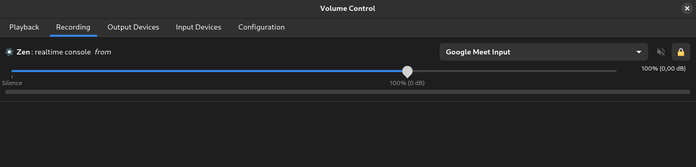
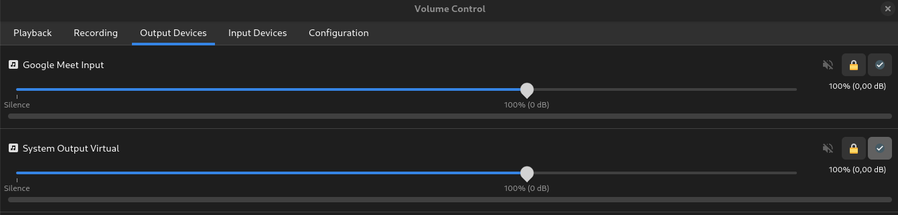

# Pass Interview


Demo of an LLM agent passing a technical interview. Uses OpenAI Realtime API for
voice and a Chrome extension for typing.

Backend forked from https://github.com/openai/openai-realtime-console.

## Prerequisites

- OpenAI API key (you will be prompted to enter it when app is started)
- Browser extension in Google Chrome (enter path to it: `browser_extension/`)
- *(For MacOS) Blackhole-16ch to bridge audio from Google Meet to React app and
  back
- *(For Linux) Pipewire to bridge audio from Google Meet to React
  app and back, see
  [Setup Linux Audio Devices](#setup-linux-audio-devices) for configuration details

*Support for other platforms will be added soon

## Installation

1. Clone the repository:
   ```bash
   git clone https://github.com/PalisadeResearch/pass-interview.git
   cd pass-interview
   ```

2. Install dependencies:
   ```bash
   npm i
   ```

3. Create two new virtual audio devices:
   - Open Audio MIDI Setup
   - Create two aggregate devices, for linux see [Setup Linux Audio Devices](#setup-linux-audio-devices)
   - In each of them label channels either 1 and 2 or 3 and 4
   - Name them accordingly
   - Set first device as mic in Google Meet
   - Set second device as default system speaker in Settings

4. Configure the Chrome Extension:
   - Install the extension from `browser_extension/`
   - Copy your extension ID from Chrome (chrome://extensions/)
   - Update the extension ID in `src/pages/ConsolePage.tsx`:
   ```typescript
   chrome.runtime.sendMessage(
     'YOUR_EXTENSION_ID_HERE', // Replace with your extension ID
     { type: 'CODE_FROM_REACT', code: code },
   ```

5. Start the application:
   - Create a new Repl at [replit.com](https://replit.com)
   - Run the development server:
   ```bash
   npm start
   ```
   - Enter your OpenAI API key when prompted

## Customization

### System Instructions

You can modify the AI agent's behavior by editing the instructions in
`src/utils/conversation_config.js`. This file contains the system instructions
that define how the agent should behave and respond.

### Code Display Animation

The code typing animation can be customized in `src/pages/ConsolePage.tsx` by
modifying the `typeCode` function.

### Initial Conversation Message

You can modify the first message sent to the AI agent by editing the
`connectConversation` function in `src/pages/ConsolePage.tsx`.

# Setup Linux Audio Devices

There are two major audio device services under Linux: PulseAudio and Pipewire. This guide will cover Pipewire, the more modern audio server.

## Pipewire

Pipewire is a modern audio server that allows you to create virtual audio devices and is the default audio server for many common Linux distributions (e.g., Arch, Fedora 34+, Manjaro, Ubuntu 22.04+). If your system is running Pipewire, you can set up the audio devices by running the following command:

```bash
 cat > ~/.config/pipewire/pipewire.conf.d/99-virtual-devices.conf << EOF
context.modules = [
  {
    name = libpipewire-module-loopback
    args = {
      node.name = "google-meet-input"
      node.description = "Google Meet Input"
      capture.props = {
        media.class = "Audio/Sink"
        audio.position = [ FL FR ]
        audio.rate = 24000    
        audio.format = "F32"
      }
      playback.props = {
        media.class = "Audio/Source"
        audio.position = [ FL FR ]
        audio.rate = 24000 
        audio.format = "F32"
      }
    }
  }
  {
    name = libpipewire-module-loopback
    args = {
      node.name = "system-output-virtual"
      node.description = "System Output Virtual"
      capture.props = {
        media.class = "Audio/Sink"
        audio.position = [ FL FR ]
        audio.rate = 24000 
        audio.format = "F32"
      }
      playback.props = {
        media.class = "Audio/Source"
        audio.position = [ FL FR ]
        audio.rate = 24000    
        audio.format = "F32"
      }
    }
  }
]
EOF
```

After running the command above, two new devices, "Google Meet Input" and "System Output Virtual," should be created. Restart your computer for the changes to take effect. Next, we will verify that the devices were created successfully.

### Verifying the Google Meet Input

Open Volume Control and select "Recording". You should see "Google Meet Input" listed as an input device, as shown in the screenshot below:



### Verifying the System Output Virtual

Open Volume Control and select "Output". You should see "System Output Virtual" listed as an output device, as shown in the screenshot below:



